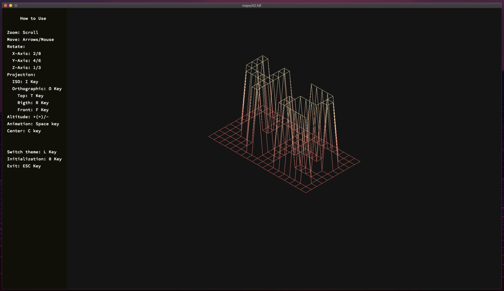

# Lem_in

is a 42 school project. The program takes a map as parameter and creates its 3d representation. You can rotate models, color is defined by relative height in the map.

## Compiling and running

Run `make`. an executable will compile. **currently only tested on macOS**.

Run it with `./fdf [map]`. a bunch of sample maps are provided in the maps directory. The one in the screenshot above is maps/42.fdf.

## Resources

- [Subject](https://cdn.intra.42.fr/pdf/pdf/1803/fdf.en.pdf)
